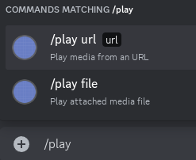
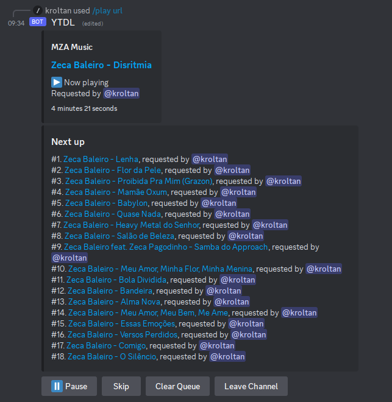

# Media-Kord

A Discord bot that plays media on your voice channel, made with [Lavaplayer] and [Kord].

- Plays URLs or attached files;
- Supports all formats and sources included in [Lavaplayer];
- Playlists controlled by message interactions;
- Supports pausing;
- Clean UI, reuses the same public message, and cleans up after itself.

<table>
<tr>
<td></td>
<td></td>
</tr>
</table>

## Running the bot

It takes a Discord bot token in the first command-line argument.

You can also use the `run.sh` script that reads said token from the `api_token.env` file.

[Kord]: https://github.com/kordlib/kord
[Lavaplayer]: https://github.com/sedmelluq/lavaplayer